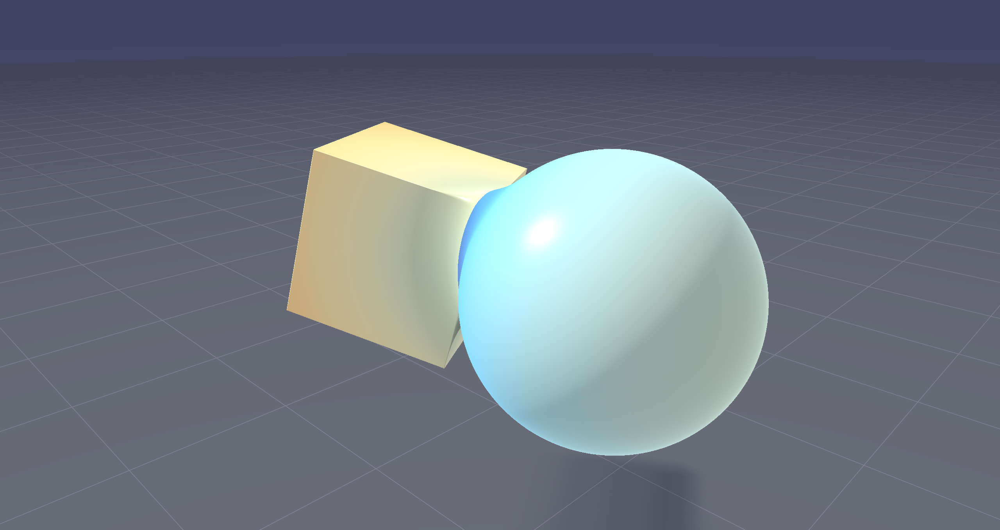
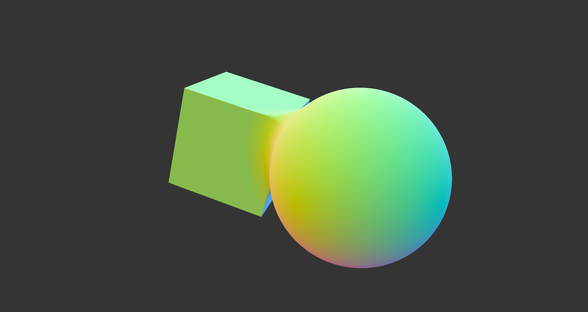
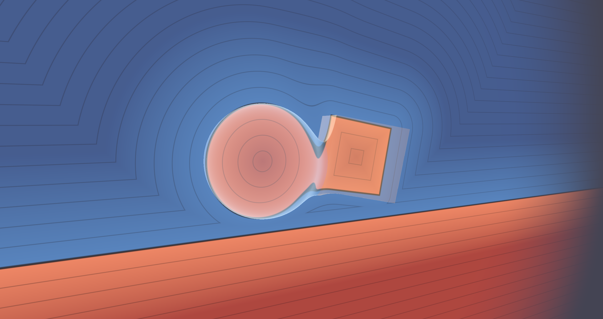
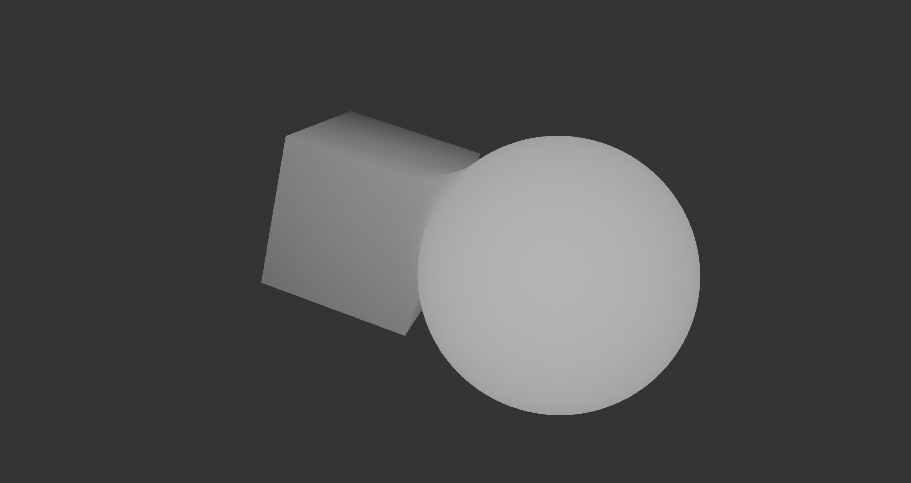
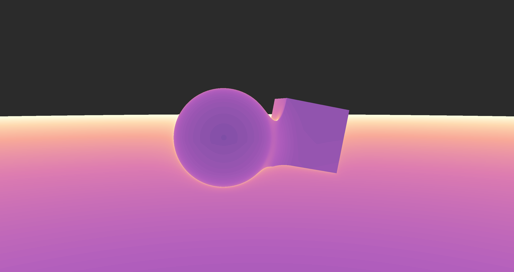
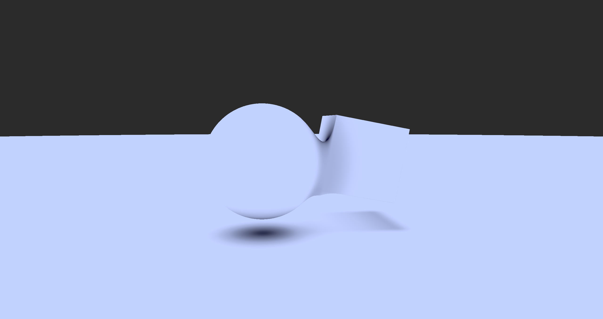

# Signed Distance Field Explorer 

A real-time Signed Distance Field (SDF) raymarching engine built with WebGL 2.0 (#version 300 es) and Three.js. It features a live-editable shader UI, allowing for rapid experimentation with mathematical geometry, boolean operations, and PBR lighting.

Main motivation of creation was to learn more about the signed distance fields and operations on them while also looking at the live changes and debug visualizations.

## Render Mode Comparison

| PBR Shaded | Surface Normals | Analytical Slice |
| :---: | :---: | :---: |
|  |  |  |
| *Full lighting & soft shadows.* | *Gradient vectors.* | *Cross-section & contours.* |

| Depthmap | Step Count Heatmap | Ambient Occlusion |
| :---: | :---: | :---: |
|  |  |  |
| *Surface depth map.* | *Rendering iteration cost.* | *Proximity shadowing.* |

## Observations
- **PBR Pipeline:** Implements Cook-Torrance BRDF with adjustable metalness and roughness.
- **Slicing Engine:** Enables 3D plane-clipping with procedural ISO-contours for field debugging.
- **Optimization:** Render cost increases at object silhouettes, visible in heatmap mode.
- **Blending:** Uses polynomial smooth union for organic transitions between primitives.

## Features
- **Live Editor:** Hot-reloading GLSL editor with error tooltips.
- **Diagnostic Tools:** Toggle between distinct visualization modes.
- **Soft Shadows:** Distance-aware penumbra estimation.
- **Camera:** Orbit controls with position/matrix persistence for shaders.